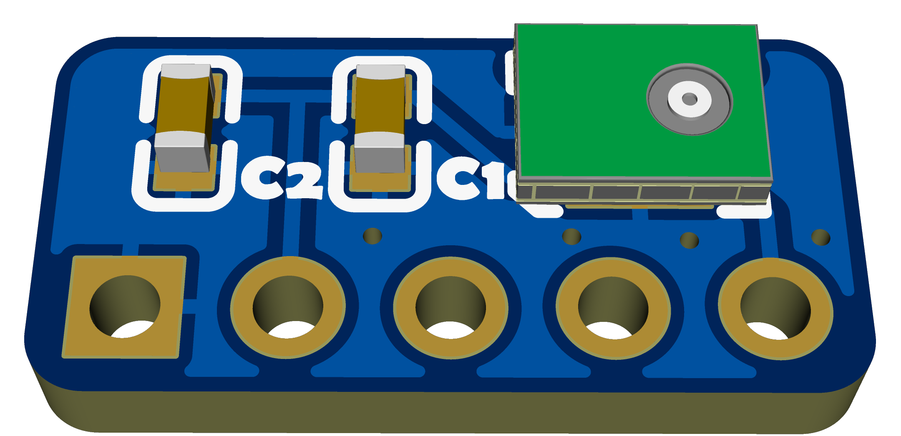
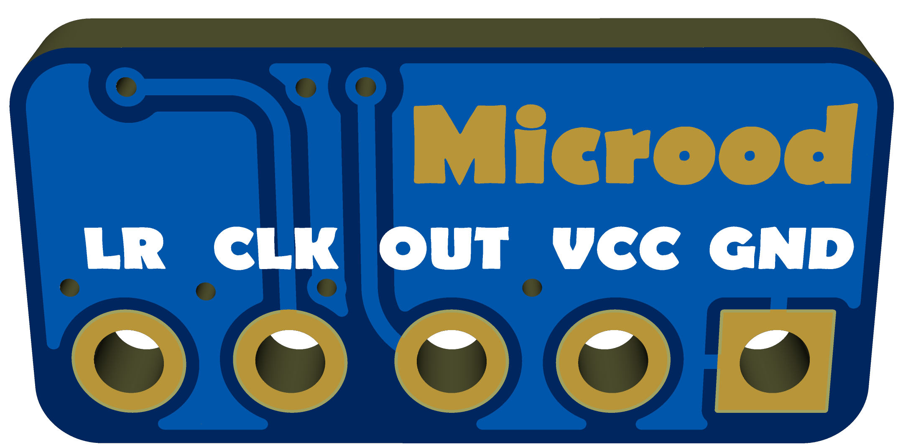

# MiNi Microphone Module

基于 **MP34DT05TR-A** 的超小型数字 MEMS 麦克风模块，PDM 输出，适用于 ESP32-S3 等 MCU 的语音采集场景。

## 预览

| 正面 | 背面 |
|------|------|
|  |  |

## 特性

- **芯片**: MP34DT05TR-A (ST)
- **输出**: PDM (Pulse Density Modulation)
- **信噪比**: 64 dB
- **灵敏度**: -26 dBFS
- **供电**: 1.6V - 3.6V
- **尺寸**: 超小型 PCB 设计

## 文件结构

```
MiNi-Microphone/
├── hardware/
│   ├── MicroPhone.eprj    # 立创 EDA 工程文件
│   ├── Gerber.zip          # Gerber 制造文件（可直接发给 PCB 厂）
│   └── BOM.xlsx            # 物料清单
├── docs/
│   ├── img.png             # PCB 正面
│   └── back.png            # PCB 背面
├── LICENSE
└── README.md
```

## 使用

1. 直接用 `hardware/Gerber.zip` 下单打板
2. 按 `hardware/BOM.xlsx` 采购元件并焊接
3. 连接到 MCU 的 I2S/PDM 接口即可采集音频

## 许可证

MIT License
